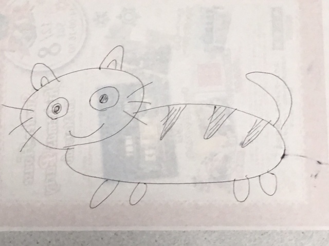
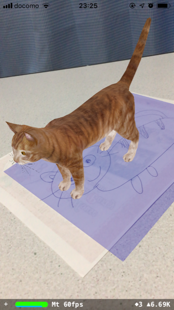

## Photo AR

*子どもと一緒に楽しめるかも...アプリ(第2弾)*  

1. 概要

    - AR上で写真をスキャンして3Dデータを表示する

1. 環境

    - Xcode 10.1
    - Swift 4.2.1
    - Man-hour 2.0h

1. 学び / ポイント

    - AR機能の使い方 / SceneKit, ARKit

1. イメージ

    |                           Screen1                           |     |                           Screen2                           |
    |-------------------------------------------------------------|-----|-------------------------------------------------------------|
    |  | >>> |  |

1. ソースコード

    [GitHub](https://github.com/nsuhara/swift-PhotoAR.git)
